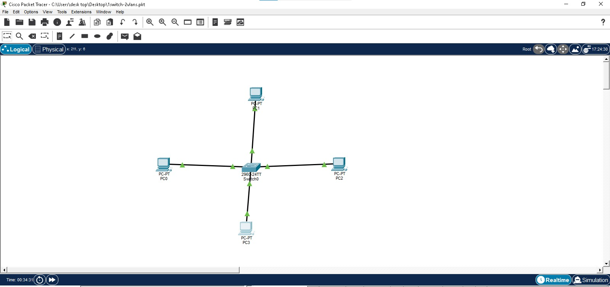
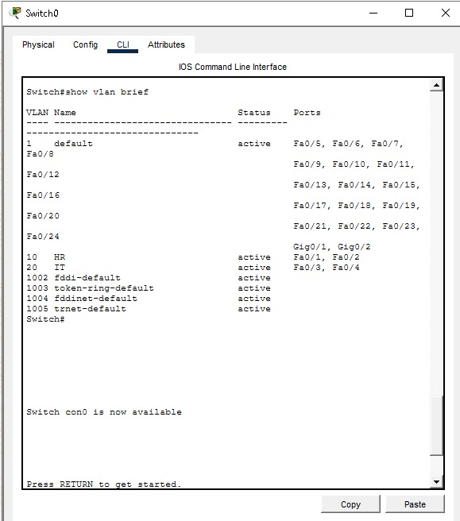
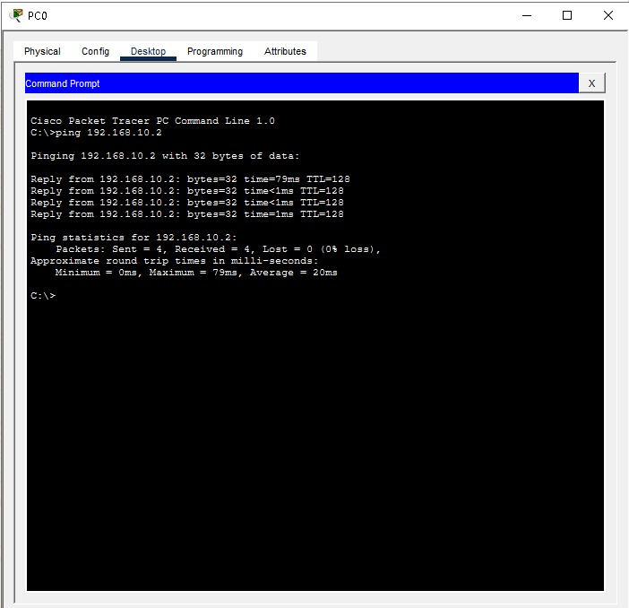
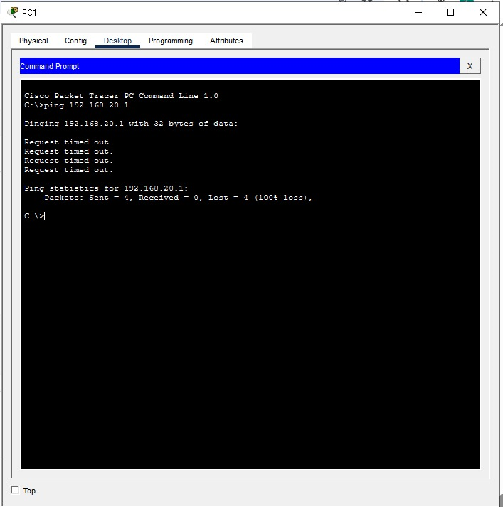

# Cisco-vlan-configuration
# Cisco VLAN Configuration Project

## Objective

Designed and configured VLANs on a Cisco switch to segment network traffic and control communication between different departments.

## Network Design

* 1 Cisco Switch
* 4 PCs
* VLAN 10 for HR department
* VLAN 20 for IT department

## Configuration Tasks

* Created VLAN 10 and VLAN 20
* Assigned switch ports to VLANs
* Configured IP addresses for each VLAN
* Verified communication within VLANs
* Verified isolation between VLANs

## Results

* Devices in the same VLAN communicated successfully
* Devices in different VLANs were unable to communicate
* Network segmentation was successfully implemented

## Technologies Used

* Cisco Packet Tracer
* VLAN Configuration
* Switch Port Assignment
* IP Addressing
* Connectivity Testing

## Project Files

* vlan-network-project.pkt

## Screenshots

### Network Topology

### VLAN Configuration

### Same VLAN Communication Test

### VLAN Isolation Test

## Skills Demonstrated

* VLAN creation and management
* Network segmentation
* Basic switch administration
* Connectivity verification using ping

## Author

Kgothatso Seshoka
